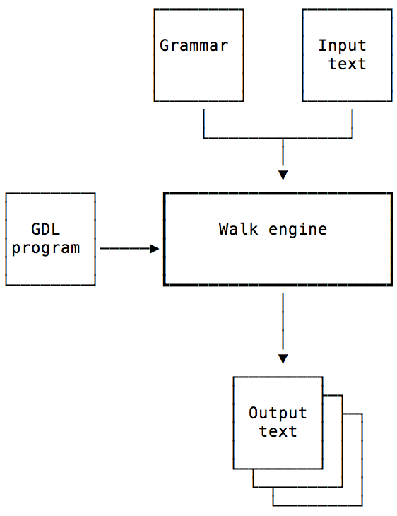

# Walk Engine in a nutshell
Walk engine is a text to text tool that is highly flexible.
It takes a *grammar*, *input text* and *program(GDL)* to generate *output text(s)*.



## Key features

* Walk is highly **flexible** and can ingest any *input text*, as a *grammar* explains how this input is structured and therefore should be interpreted.
* Walk can **generate any text** , as you describe in a *GDL program* what will appear in the *output text(s)*.
* Walk follows a **minimalist approach** and only depends on standard C++ Libraries, i.e. *stdio, stdlib, iostream and regex*.
* Walk is completely written is C++ and thus **incredibly fast**.

## Installation
Walk engine was written in C++ more than 20 years ago on SGI workstations. The current implementation runs on MacOSX and should run on any UNIX machines. First, download this git repository. Then build the executable from C++ Sources:
````
cd src
make
````
This should normally results in a WalkEngine appearing in the /bin directory.

## Basics
Walk engine was designed to take any text file in input. Some examples are provided in the /test directory. Have a look at [The Tragedy of Hamlet, Prince of Denmark](./test/theater/HamletActI.tht) as an example.
Don't be worried by the .tht extension, it is simply there to remind you this text follows the **Theater** grammar.(see below)

## Grammar
A grammar describes in a set of *simple rules* how you input text is structured and should be interpreted, eg theater.meta starts like this:
````
theater        grammar $play $skip
skip            manyOf $comment #null #null #null
comment         sequence '//' $rol $eol
play            sequence name=$rol $eol $acts
...
rol             token '^.+'
eol             token '^\n'
````
The first line tell you that *'theater'* is a **grammar**, *'play'* is the grammar's main rule and *'skip'* explains what text should be ignored (in this case one or more comment(s) such as ''// this is a comment.'). The last line informs you that the input text is a *play* including a name (*'rol'* stands for rest of line, *'eol* for end of line') and *acts*.
Four types of rules are supported in a *grammar*: *sequence*, selection (=*oneOf*), repetition (=*manyOf*) and regular expressions (=*token*).

## Generation Description Language (GDL)
GDL is a programming language that helps you to describe the output(s) to generate.
See this [small tutorial](./doc/GDLIntro.md) based on the theater example to learn more about it.

>Still with me: Good!

## How could that be?
WalkEngine executes as follow:
1. Read the *grammar* and store it
2. Read/Parse the *input* file according to the grammar and store it as nodes
3. Read/Parse the *generation program* (or gdl) and store it
4. Run this GDL program and generate the *output*
5. Last but not least, delete all these (C++) objects. No Garbage collector to do the work automatically!

A typical run will look like this:
````script
$ ../../Bin/WalkEngine theater.meta HamletActI.tht title.gdl out
Meta parsing...
... end meta parsing
Source parsing...
... end source parsing
Parsing your WALK program...
... end of WALK program load/parse
Executing your WALK program...
... end of execution(1 statements).
Deleting program
Deleting source
Deleting parser
Deleting meta
````
## Command Line
WalkEngine normally takes four parameters:
* a grammar (.meta file)
* an input text file
* a GDL program
* an output text file

## A bit of history
I developed this code generator in 1996 while working on *IVS* (an early VoD system built on top of *Aperios OS*) at Sony Europe.
At that time it was mostly used to convert [IDL](https://en.wikipedia.org/wiki/Interface_description_language) into C++ or HTML and to draw [Message Sequence Charts](https://en.wikipedia.org/wiki/Message_sequence_chart) from text.

*-TO DO: Explain Grammar, GDL statements and give more examples...-*

On Aperios OS, read [SONY'S PLAN FOR WORLD RECREATION](https://www.wired.com/1999/11/sony-3/) by David Sheff, 1999.
